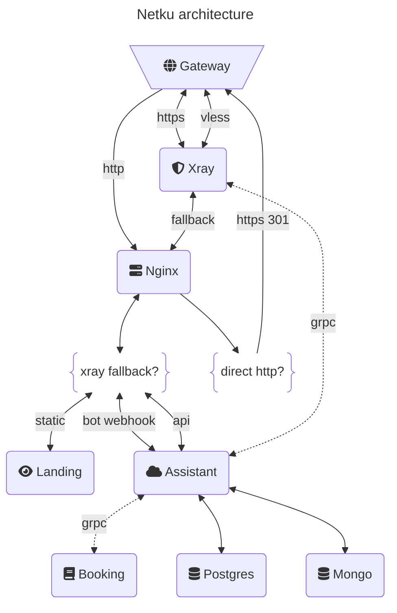

<link
  href="https://cdnjs.cloudflare.com/ajax/libs/font-awesome/6.5.1/css/all.min.css"
  rel="stylesheet"
/>

##  My own server unit.

### Contains:

1. Simple [xray](https://github.com/XTLS/Xray-core) implementation (named **xray**).
2. Assistant which (named **assistant**):
   1. Controls xray by grpc.
   2. Sends any alerts by TG bot.
3. Business card page for xray fallback (named **landing**).
4. **NGINX** http server for routing **1.**, **2.** and **3.** (named **server**).
5. Web automation service for auto booking NSU washing machines (named **booking**).

---

---

### Envs:

- You can open [envs](./.env.example) for looking environment variables off app.
