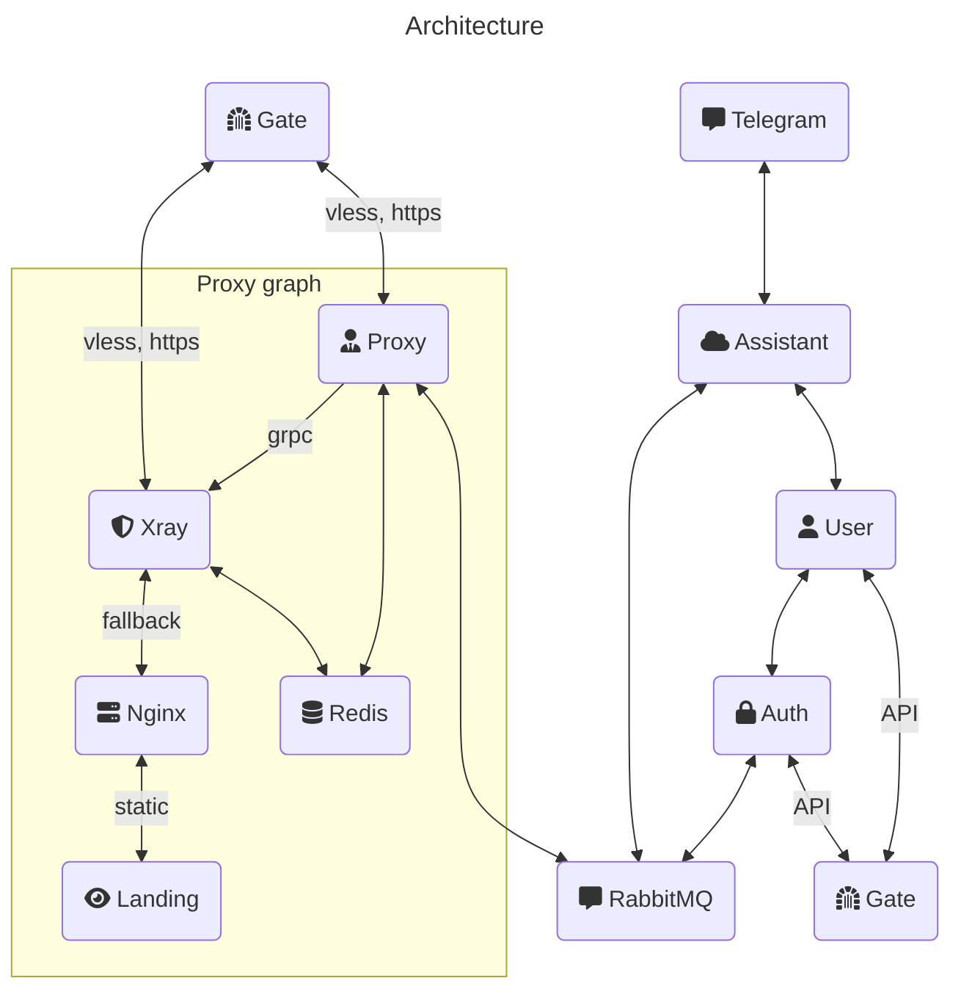

<link
  href="https://cdnjs.cloudflare.com/ajax/libs/font-awesome/6.5.1/css/all.min.css"
  rel="stylesheet"
/>

##  My own server unit.

---

### Envs:

Each service has own env variables.
You might check them in corresponding folders.
