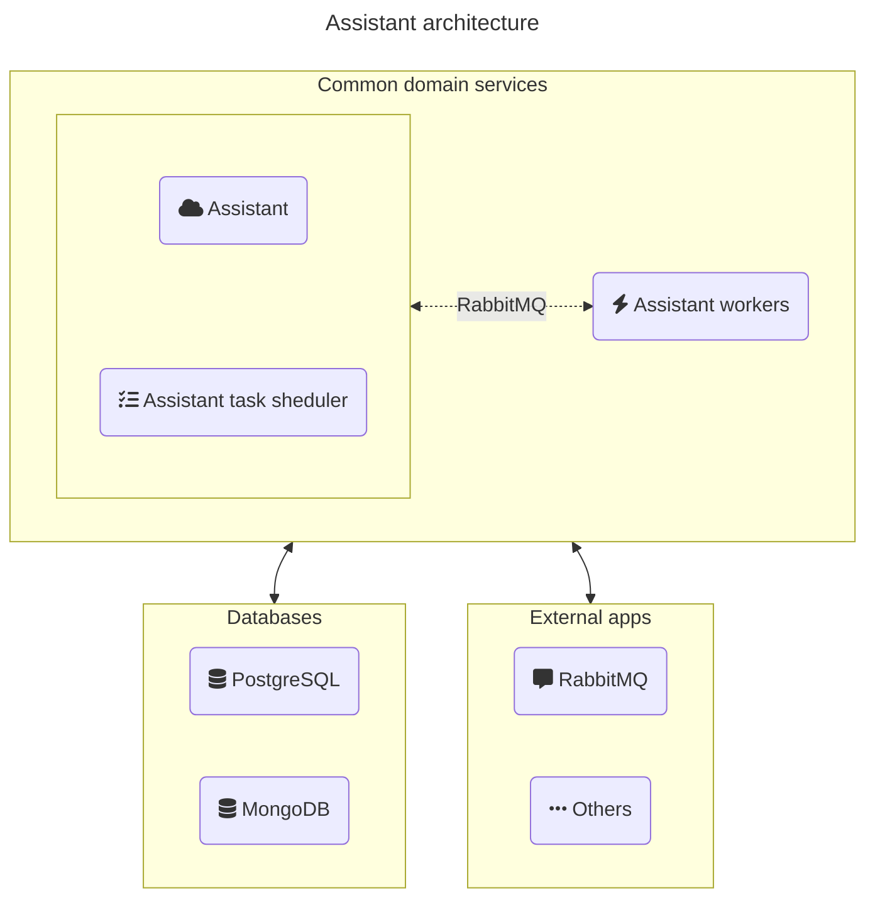

<link
  href="https://cdnjs.cloudflare.com/ajax/libs/font-awesome/6.5.1/css/all.min.css"
  rel="stylesheet"
/>

```mermaid
---
title: Assistant architecture
---
flowchart TD
    subgraph assistant [Common domain services]
        subgraph initializers [ ]
            A(fa:fa-cloud Assistant)
            A-T(fa:fa-list-check Assistant task sheduler)
            A~~~A-T
        end
        A-W(fa:fa-bolt Assistant workers)
    end

    initializers <-.-> |RabbitMQ| A-W

    subgraph db [Databases]
    P(fa:fa-database PostgreSQL)
    M(fa:fa-database MongoDB)
    end

    subgraph external [External apps]
    R(fa:fa-message RabbitMQ)
    E(fa:fa-ellipsis Others)

    end

    assistant <--> db
    assistant <--> external
```
